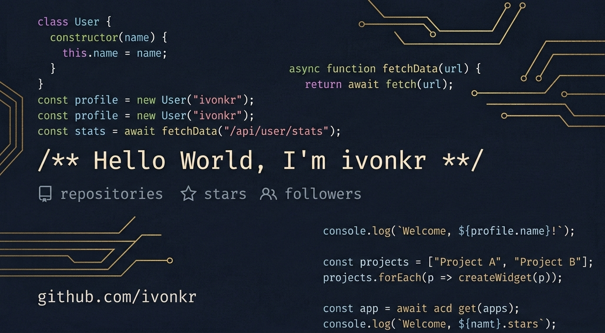

  

  # Hola, Soy Ivo 👋

  ⚡ *En constante aprendizaje, realizando proyectos para pulir mis habilidades y estar al tanto de las nuevas tecnologías.*

  

    
    
  

---

### 📊 Mis Estadísticas

  
  

---

### 🛠️ Tecnologías y Herramientas

#### 💻 Lenguajes

  
  
  
  
  
  
  
  

#### 📚 Frameworks y Librerías

  
  
  
  
  
  
  
  
  

#### ☁️ Bases de Datos y Cloud

  
  
  
  
  
  
  
  

#### ⚙️ Software y Más

  
  
  
  
  
  
  
  
  
  
  
  

